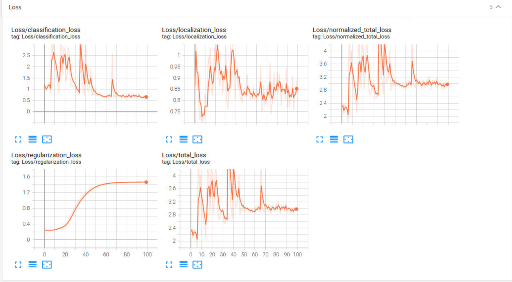
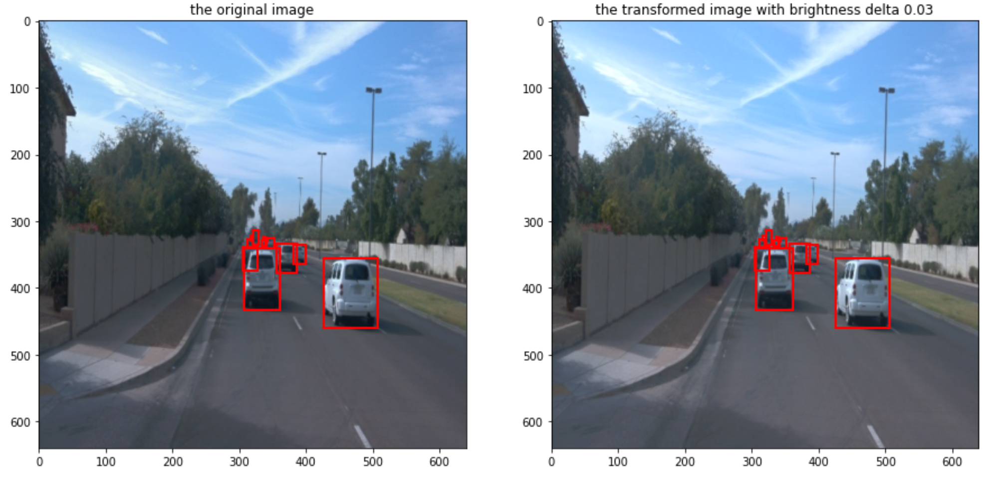

# Object detection in an Urban Environment

## Project overview
This project uses deep learning object detection algorithms to detect objects in images from the car's camera.

## Setup
you can use Workspace or Local Setup

### Workspace
Udacity's virtual machine for this project

### Local Setup

For local setup if you have your own Nvidia GPU, you can use the provided Dockerfile and requirements in the [build directory](./build).

Follow [the README therein](./build/README.md) to create a docker container and install all prerequisites.

### Download data
For this project, we will be using data from the [Waymo Open dataset](https://waymo.com/open/). The files can be downloaded directly from the website as tar files or from the [Google Cloud Bucket](https://console.cloud.google.com/storage/browser/waymo_open_dataset_v_1_2_0_individual_files/) as individual tf records.
 
 
```
curl https://sdk.cloud.google.com | bash

source ~/.bashrc

gcloud auth login
```
### Split the original dataset into training, validation and test

```
python download_process.py --data_dir /home/workspace/data/ --temp_dir /home/backups/
```

## Dataset
### EDA
There are three categories of pictures, namely vehicles, pedestrians and cyclists.  

Here we show 4 images and their boxes. 

 
 
 


We used one thousand images as a dataset to get the image containing the most instances in one thousand images.  
From the images it can be concluded that the dataset contains many road scenes, from day to night, from urban to highway situations.    
And where urban scenes may be difficult to be trained by the model because there are many instances and the boxes are highly overlapping.      
Dark scenes are also difficult to process because the lack of lighting makes the image lack the necessary information, despite the presence of boxes.

 
 
 


And the categories are also highly biased, with only 12 instances of cyclists in a thousand images, despite the existence of 16,841 instances of cars.
 


### Cross validation
Due to the storage and GPU limitations of the udacity VM, only 15 tfrecords from waymo were processed and used.    
Of these, 60% are used for the training dataset, 20% for the validation dataset, and the remaining 20% for the test dataset.

## Training

### Edit the config file

First, let's download the [pretrained model](http://download.tensorflow.org/models/object_detection/tf2/20200711/ssd_resnet50_v1_fpn_640x640_coco17_tpu-8.tar.gz) and move it to `training/pretrained-models/`. 

Now we need to edit the config files to change the location of the training and validation files, as well as the location of the label_map file, pretrained weights. We also need to adjust the batch size. To do so, run the following:
```
python edit_config.py --train_dir /home/workspace/data/train/ --eval_dir /home/workspace/data/val/ --batch_size 4 --checkpoint ./training/pretrained-models/ssd_resnet50_v1_fpn_640x640_coco17_tpu-8/checkpoint/ckpt-0 --label_map label_map.pbtxt
```
A new config file has been created, `pipeline_new.config`.

In `pipeline_new.config`, the `num_steps` is `25000` and the `warmup_steps` of `cosine_decay_learning_rate` is `2000`. The data augmentation: `random_horizontal_flip` and `random_crop_image`.   

In order to speed up the computation, the `num_steps` is changed to `100` and the `warmup_steps` of `cosine_decay_learning_rate` is changed to `20`. No data augmentation.

### Reference experiment
This section should detail the results of the reference experiment. It should includes training metrics and a detailed explanation of the algorithm's performances.

You will now launch your very first experiment with the Tensorflow object detection API. Create a folder `training/reference`. Move the `pipeline_new.config` to this folder. You will now have to launch two processes: 
* a training process:
```
python experiments/model_main_tf2.py --model_dir=training/reference/ --pipeline_config_path=training/reference/pipeline_new.config --checkpoint_every_n=50
```
* an evaluation process:
```
python experiments/model_main_tf2.py --model_dir=training/reference/ --pipeline_config_path=training/reference/pipeline_new.config --checkpoint_dir=training/reference/
```

NOTE: both processes will display some Tensorflow warnings.

To monitor training, you can start a tensorboard instance by running the following command:

1. check the location of Tensorflow
```
pip show tensorflow
```

2. Go to that location you get from the above output.
```
cd /data/virtual_envs/sdc-c1-gpu-augment/lib/python3.7/site-packages/tensorboard
```
3. Execute the following command to launch the tensorboard.
```
python main.py --logdir=/home/workspace/training
```
4. open board in the web
```
localhost:6006
```

The training results are as follows:   
As can be seen from the figure, the training results seem to be stable, but the loss is very high, probably because the training step is too small, only 100, compared with the original step (25000). And there is no data augmentation.


## Improve the performances
### Data augmentation
From the EDA we can see that light is a very important factor affecting the traveling image. Therefore, we adjust the different lighting conditions of the simulated driving image by changing the brightness. (Different lighting is normal in driving, but other traditional image augmentation such as ``random_horizontal_flip`` are a bit strange because you are less likely to break traffic rules and drive in the wrong lane.)

 
 
 


### Experiment and discussion
On top of `pipeline_new.config`, we make the following changes, and name the new config `pipeline_new_v1.config`   

| parameter | new |
| ------ | ------ |
| `optimizer ` | adam_optimizer |
| `learning_rate_base` |  0.01 |
| ``batch_size`` | 4 |
| ``data_augmentation_options `` | random_adjust_brightness  |
| ``warmup_learning_rate`` |  0.003  |

The training results are as follows:   
From the figure, it can be seen that the training result has a very large loss compared to the reference, probably due to the improper ``adam`` optimizer.


On top of `pipeline_new.config` and the previous experiment, we make the following changes, and name the new config `pipeline_new_v2.config`   


| parameter | new |
| ------ | ------ |
| `optimizer ` | momentum_optimizer |
| `learning_rate_base` |  0.03 |
| ``batch_size`` | 4 |
| ``data_augmentation_options `` | random_adjust_brightness  |
| ``warmup_learning_rate`` |  0.01 |
| ``warmup_steps`` |  10  |


The training results are as follows:   
From the figure, it can be seen that the training loss is reduced compared to the reference.


The eval results are as follows:    
The eval results do not perform well, probably because we only use a small dataset for training and the training steps are only 100.


Due to udacity's GPU and storage limitations. I can't do more experiments. But the feasible enhancements are as follows:
1. So far we have used the `ssd_resnet50_v1_fpn_keras` model, we could use a deeper model.
2.  Using more data, we only used 9 tfrecord as training dataset due to GPU and storage limitations.
3.  Use a larger ``batchsize``


## feedback from mentor
